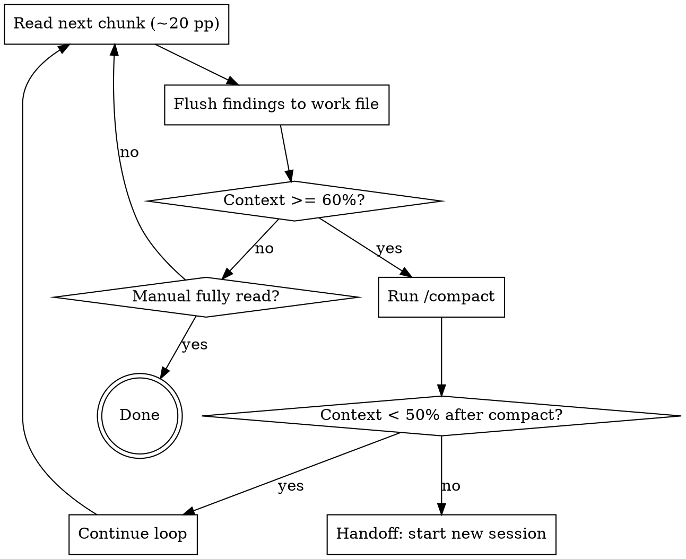
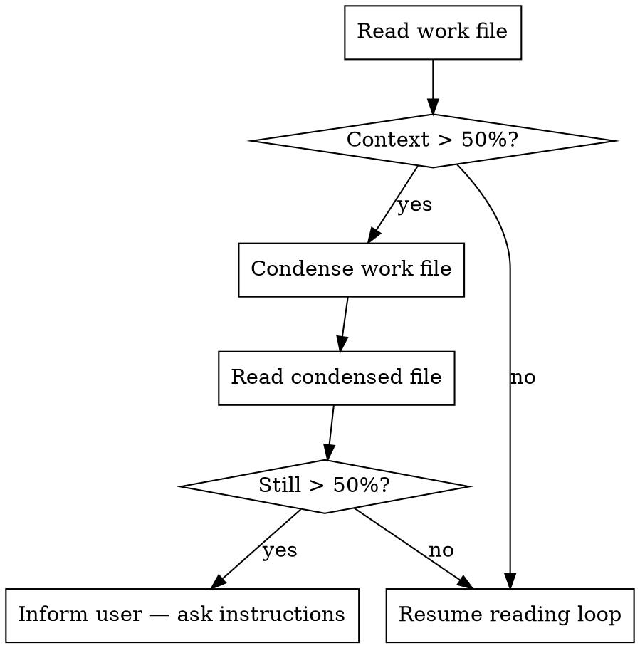

# Device Manual I/O Extraction

## Overview

Read device manuals iteratively to build a thorough markdown document of all I/O capabilities. The manual is too long for one context window; you manage this with explicit thresholds, compaction, and session handoffs. The work file is your persistent memory — the final I/O interface document emerges from it.

## Setup (Do Once Before Reading)

1. **Check context usage** via `/context`. Note baseline token %.
2. **Create the work file** at a path the user confirms (e.g., `./device_io.md`). Include this skeleton:
   ```markdown
   <!-- PROGRESS: [list chapters/sections with DONE/IN-PROGRESS/NOT-STARTED and page ranges] -->
   <!-- CHECKPOINT: Next read: [section], pp. [N]-[M] -->

   # [Device Name] I/O Interface

   ## Digital Inputs
   ## Digital Outputs
   ## Analog Inputs
   ## Analog Outputs
   ## Registers / Memory Map
   ## Communication Protocols
   ## Pin / Terminal Mappings
   ## Signal Specifications
   ## Open Questions / Gaps
   ```
3. **Read the TOC first** (first 20-40 pages). Map which chapters contain I/O content; flag chapters to skip (safety, warranty, mechanical mounting). Update the PROGRESS block.

## Reading Loop (Repeat Until Manual Is Done)



**Chunk size:** ~20 pages per read call. Dense sections (register tables, pin maps) → 10 pages. Prose-heavy sections → 25 pages. Never read 50+ pages in one call — a single oversized read can push context past 60% before you can flush.

**Flush means:** write all extracted I/O facts to the work file before the next read. Never carry findings in context across a chunk boundary. Update the CHECKPOINT line each time.

## Starting a New Session

Tell the user: "Context is full. Please start a new Claude Code session and begin with: 'Continue device manual extraction. Work file: [path].'"

At the start of the new session:



## Condensing the Work File

Condense only when the work file itself exceeds the 50% budget in a fresh session.

**Rules for condensation — NOTHING informing the I/O interface may be lost:**
- **KEEP:** All register addresses, signal names, data types, pin assignments, voltage/current ranges, protocol parameters, addressing schemes, timing specs, bitmasks, enumerations, and mode descriptions.
- **DROP:** PROGRESS block, CHECKPOINT comments, Open Questions already resolved, prose explanations that restate a table in narrative form, duplicate entries.
- **Compact tables:** Merge rows if identical except for one field (e.g., DI channels 1-16 all identical → one row with "channels 1-16").
- **Strip context narrative:** Remove sentences like "Chapter 3 describes…" — keep only the extracted data.

Save the condensed version to the same file path (overwrite) or to `[basename]_condensed.md` if the user prefers a backup.

## Escalation

If reading a freshly condensed work file still consumes > 50% of a new session's context, **stop and inform the user:**

> "The condensed work file alone exceeds 50% of the context budget. Options:
> 1. Split the work file into sections (e.g., one file per I/O category) and continue section by section.
> 2. Use a model with a larger context window.
> 3. Manually trim the work file and restart the session."

Do not proceed without user instruction.

## Reading Priority

Read high-value chapters before low-value ones:

| Priority | Content |
|----------|---------|
| 1 — Read carefully | Digital I/O, Analog I/O, Register/Memory map, Protocol chapters, Pin/wiring diagrams |
| 2 — Skim | System overview, Software config, Diagnostics |
| 3 — Skip unless referenced | Safety, Warranty, Mechanical installation |

If a section cross-references another ("see Appendix B for register addresses"), jump to that section first.

## Handling Tables and Diagrams

- **Register maps:** Extract address, name, data type, R/W, description → markdown table immediately.
- **Pin diagrams:** Describe in text what the diagram shows. Note the page number for human verification.
- **Garbled PDF tables:** Record page number and flag in Open Questions as "requires manual review — pp. N."

## Common Mistakes

| Mistake | Fix |
|---------|-----|
| Reading 50+ pages in one call | Keep chunks to ~20 pp; oversized reads can skip past 60% before you flush |
| Carrying findings in context without flushing | Flush to file after every chunk, before the next read |
| Using vague "context feels full" judgment | Check `/context`; use 60% as the hard stop |
| Skipping compaction and jumping straight to new session | Always try `/compact` first — it often recovers enough headroom |
| Dropping progress/checkpoint on condense | PROGRESS and CHECKPOINT are dropped intentionally; they're reconstructible from what's left |
| Condensing too aggressively (losing signal specs) | When in doubt, keep the data; the point is removing meta-commentary, not data |
